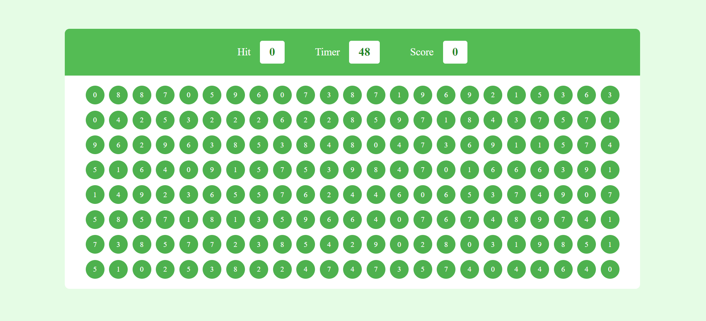

# Bubble Game 🫧
## Overview
Bubble Game is a simple JavaScript-based game where players are presented with circles containing random numbers from 0 to 9. The objective of the game is to find and click on the circles containing the number displayed in the hint box within a time limit of 60 seconds.

## [Click here to play game](https://vishalgiri8767.github.io/Bubble-Game/)

## Preview

## Game Mechanics

### Starting the Game
When the game starts, a countdown timer of 60 seconds begins.

### Circle Numbers
There are multiple circles displayed on the screen, each containing a random number between 0 to 9.

### Hint Box
The hint box displays a random number between 0 to 9, which the player needs to find among the circles.

### Game Objective
The player's objective is to click on the circle(s) that contain the number shown in the hint box.

### Scoring
If the player clicks on the correct circle containing the number matching the hint, their score increases by 1 point.

### Time Limit
The game ends when either the player finds and clicks on the correct number within the 60-second time limit or when the time runs out.

## Getting Started
To play the game, open the `index.html` file in a web browser that supports JavaScript.

## Technologies Used
- HTML
- CSS
- JavaScript

## Future Improvements
- Implement levels with increasing difficulty.
- Add sound effects and visual animations.
- Include leaderboard functionality to track high scores.

## Contributors
- [Your Name or Username]

## License
This project is licensed under the [MIT License](LICENSE).
